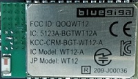

# Bluetooth WT12 library for Arduino

A Simple arduino library for the WT12 bluetooth module by Bluegiga

# Dependencies 

To generate the documentation 

* doxygen [Link](https://github.com/doxygen/doxygen)
* moxygen. [Link](https://github.com/sourcey/moxygen)
     * (npm install moxygen -g to install it)

Run the .bat file provided to generate a markdown file with the documentation

# Connection

* Connect TX/RX and VCC/GND from the module to the Arduino

# Limitations

* The module is configured so that only one connection is allowed. Unexpected disconnections are not handled.

# Links

* An alternative comprehensive library for WT modules [Link](https://github.com/jrowberg/iwrap)

